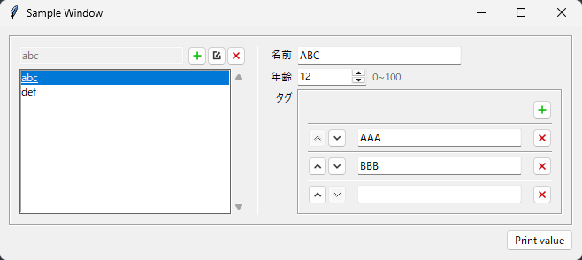

# uilib

## Overview


任意のデータ型を表現する `tkinter` ウィジットの作成機能を提供します。
作成されたウィジットは専用メソッドから設定値の取得・復元を行うことができます。

提供されるウィジットには、整数・文字列などの基本的なデータ型や、リスト・辞書などの複雑なデータ型に加え、レイアウト専用のものまで用意されており、
それらを組み合わせることで、毎回専用の処理を実装することなく、各種データ構造に対応した UI を容易に作成することができます。[^1]

[^1]: 本パッケージが提供するウィジットの一覧は [対応ウィジット](#対応ウィジット) を参照ください。

## Usage

`Print value` ボタンが押されたときにウィジットの値を出力するウィンドウを作成します。



```py
import uilib
import tkinter

tk = tkinter.Tk()
tk.title("Sample Window")
ui_root = uilib.ui.layout.UI_Layout(
  [
    [
      (
        uilib.ui.value.UI_Dict(
          {}, #初期状態は空
          add_func=lambda: uilib.ui.value.UI_HardDict( #要素追加時に UI_HardDict を作成する
            {
              "name": uilib.ui.value.UI_Str(""),
              "age": uilib.ui.value.UI_Int(0, (0, 100, 1)),
              "tag": uilib.ui.value.UI_List([], add_func=lambda: uilib.ui.value.UI_Str(""))
            },
            label_table={
              "name": "名前",
              "age": "年齢",
              "tag": "タグ"
            }
          )
        ),
        "sample_dict"
      )
    ],
    [
      (
        uilib.ui.layout.UI_Button(
          "Print value", 
          lambda: print(repr(ui_root.get_value())) #ボタン押下時に設定値を表示する
        ), 
        "", 
        1, 
        1, 
        tkinter.E
      )
    ]
  ],
  as_single_value=True #辞書ではなく単体の値として評価する
)
ui_root.build(tk).pack(padx=10, pady=10) #tkinter ウィジットを作成し配置する
ui_root.load_from_param([
  {
    "abc": {
      "name": "ABC",
      "age": 12,
      "tag": ["AAA", "BBB", ""]
    },
    "def": {
      "name": "",
      "age": 0,
      "tag": []
    }
  }
]) #パラメータからウィジットの状態を復元する
tk.mainloop()
```

```
{'abc': {'name': 'ABC', 'age': 12, 'tag': ['AAA', 'BBB', '']}, 'def': {'name': '', 'age': 0, 'tag': []}}
```

## 対応ウィジット

### データ向けウィジット

主に値の設定を行うための入力フォームを提供します。

| データ型 | クラス | 備考 |
| --- | --- | --- |
| 整数 | `uilib.ui.value.UI_Int` | 最小・最大・増減値を指定することができます。 |
| 浮動小数点数 | `uilib.ui.value.UI_Float` | 最小・最大・増減値を指定することができます。 |
| 文字列 | `uilib.ui.value.UI_Str` | |
| 真偽値 | `uilib.ui.value.UI_Bool` | |
| 列挙型 | `uilib.ui.value.UI_Enum` | |
| 列挙型（フラグ） | `uilib.ui.value.UI_Flag` | |
| パス | `uilib.ui.value.UI_Path` | ファイルダイアログを使用したファイル指定が可能です。 |
| リスト | `uilib.ui.value.UI_List` | 任意個数のデータを表現します。GUI経由による要素の追加・編集・削除が可能です。 |
| 辞書 | `uilib.ui.value.UI_Dict` | 任意個数のデータを表現します。GUI経由による要素の追加・編集・削除が可能です。 |
| 辞書 | `uilib.ui.value.UI_HardDict` | `dataclasses.dataclass` のように固定された要素をもつデータ構造を表現します。 |
| 選択肢 | `uilib.ui.value.UI_Choices` | 複数ある任意のデータの中から1つを選択します。 |
| inet アドレス | `uilib.ui.value.UI_InetAddress` | IPアドレス・ポート番号の組を表現します。 |

### レイアウト向けウィジット

こちらは値の設定よりも GUI の外観に作用するウィジットです。

| 内容 | クラス | 備考 |
| --- | --- | --- |
| テキスト | `uilib.ui.layout.UI_Text` | 折り返しを含む複数行の文章を表示します。 |
| ボタン | `uilib.ui.layout.UI_Button` | |
| トグル表示 | `uilib.ui.layout.UI_Toggle` | |
| レイアウト | `uilib.ui.layout.UI_Layout` | グリッドレイアウトを提供します。各セルごとに列幅・行幅・揃えを指定することができます。 |
| 名前付きレイアウト | `uilib.ui.layout.UI_Group` | グリッドレイアウトを提供します。各セルごとに列幅・行幅・揃えを指定することができます。 |
| ヒント | `uilib.ui.layout.UI_Hint` | マウスオーバーすることで追加情報を表示します。 |

### 特殊なウィジット

| 内容 | クラス | 備考 |
| --- | --- | --- |
| サブウィンドウ | `uilib.ui.tkinter_.sub_window.SubWindow` | |
| サブウィンドウ(ワーカー) | `uilib.ui.tkinter_.sub_window.SubWindow_Worker` | 閉じられるとワーカー処理も中断される。 |
| サブウィンドウ(進捗表示・ワーカー) | `uilib.ui.tkinter_.sub_window.SubWindow_WorkerProgression` | ワーカー処理の進捗状況を表示する。閉じられるとワーカー処理も中断される。 |
| サブウィンドウ(進捗表示・ワーカー・マルチスレッド) | `uilib.ui.tkinter_.sub_window.SubWindow_ThreadPoolWorkerProgression` | ワーカー処理の進捗状況を表示する。複数処理を並行して行う。閉じられるとワーカー処理も中断される。 |

## Install

```shell
pip install .
```

### Test

```shell
pip install .[test]
pytest .
```

### Document

```py
import uilib

help(uilib)
```

## Donation

<a href="https://buymeacoffee.com/tikubonn" target="_blank"></a>

もし本パッケージがお役立ちになりましたら、少額の寄付で支援することができます。<br>
寄付していただいたお金は書籍の購入費用や日々の支払いに使わせていただきます。
ただし、これは寄付の多寡によって継続的な開発やサポートを保証するものではありません。ご留意ください。

If you found this package useful, you can support it with a small donation.
Donations will be used to cover book purchases and daily expenses.
However, please note that this does not guarantee ongoing development or support based on the amount donated.

## License

© 2026 tikubonn

uilib licensed under the [AGPLv3](./LICENSE).
